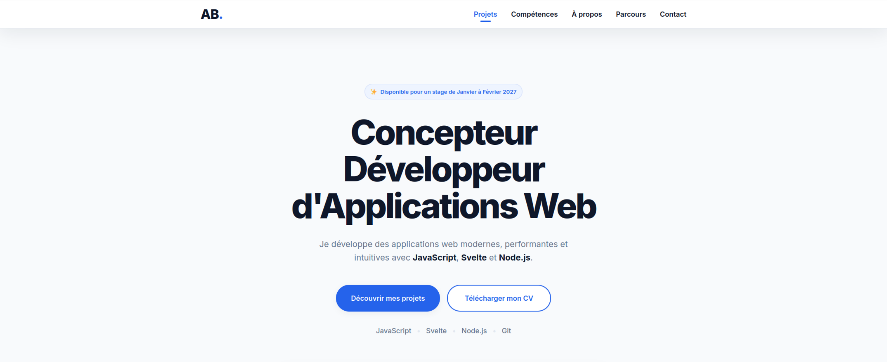
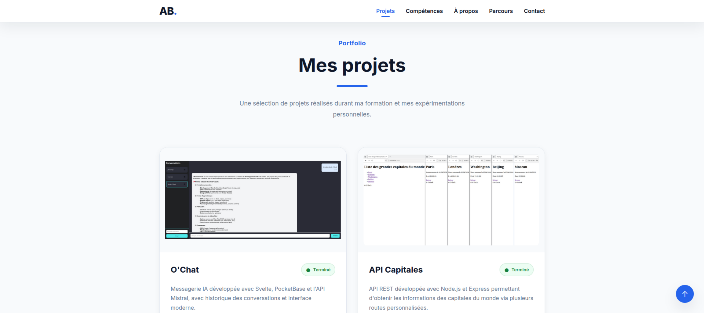
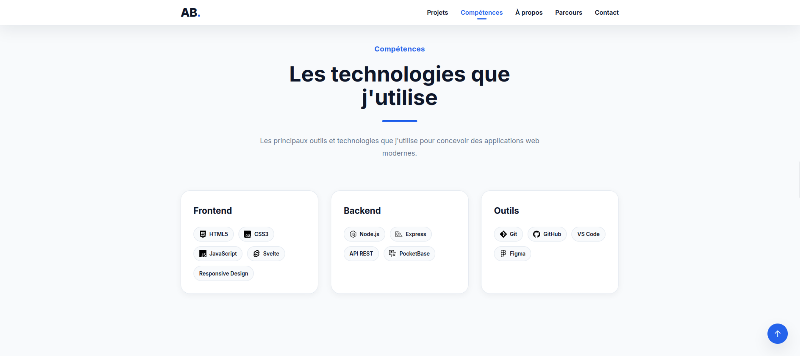
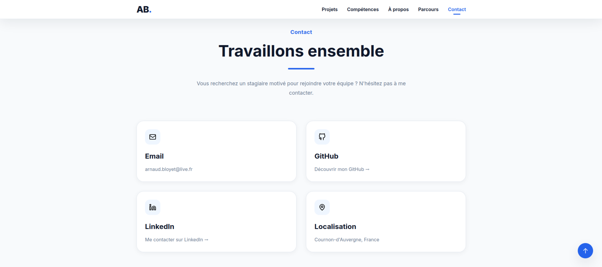

# 💼 Portfolio - Arnaud Bloyet


Bienvenue sur le dépôt de mon portfolio de développeur web.

Ce projet a été réalisé dans le cadre de ma formation **Concepteur Développeur d'Applications Web** afin de présenter mon parcours, mes compétences et plusieurs projets réalisés durant ma reconversion.

---

## 🚀 Aperçu









Le portfolio présente :

- Une présentation personnelle
- Mon parcours de reconversion
- Mes compétences techniques
- Une sélection de projets
- Une section de contact

---

## 🛠️ Technologies utilisées

- HTML5
- CSS3
- JavaScript (ES6+)
- Svelte 5
- Vite

---

## ✨ Fonctionnalités

- Design responsive
- Navigation fluide
- Animations au scroll
- Cartes interactives
- Présentation des projets
- Timeline de parcours
- Composants réutilisables

---

## 📂 Structure du projet

```text
src/
├── assets/
├── components/
│   ├── layout/
│   ├── projects/
│   ├── sections/
│   └── ui/
├── data/
├── styles/
└── App.svelte
```

---

## ⚙️ Installation

Cloner le projet :

```bash
git clone https://github.com/ArnaudBloyet/portfolio-arnaud.git
```

Installer les dépendances :

```bash
npm install
```

Lancer le serveur de développement :

```bash
npm run dev
```

Créer la version de production :

```bash
npm run build
```

---

## 👨‍💻 Auteur

**Arnaud Bloyet**

Concepteur Développeur d'Applications Web

- GitHub : https://github.com/ArnaudBloyet
- LinkedIn : https://linkedin.com/in/arnaud-bloyet-716358260/

---

## 📄 Licence

Projet réalisé à des fins pédagogiques et de présentation personnelle.